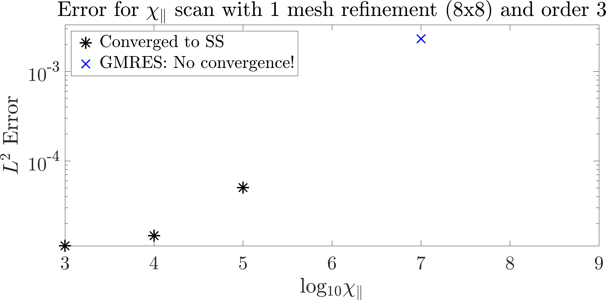

# Analysis scripts for MFEM `transport2d` output #

Running the script `run_chiscans.pl` will produce directories with outputs for a chi parallel scan over 10^3 <= chi parallel <= 10^9, for an 8x8 grid and order 3 polynomial. The directory paths in lines 6 though 9 will need to be edited to reflect the paths in your own directory structure. The input files required are provided in the `intput-files` directory in this repository. The version of `transport2d` used is commit hash 7166417 (up-to-date as of 7-JAN-2021) in the `plasma-dev` branch located at https://github.com/mfem/mfem/tree/plasma-dev/miniapps/plasma. 

This set of refinement and order was chosen as it is used in all of the Sovinec benchmark cases (10^3, 10^6, 10^9), providing a good idea for where we expect the code to converge for both high and low anisotropies, although the error is large for chi parallel = 10^9 in the Sovinec benchmark.

Running the script `read_convdata.m` should produce the figure

where missing values in the figure (chi parallel 10^6, 10^8, 10^9) indicate where the MPI Abort error occured. Again, the path in the first line should point to the directory where the MFEM output is location. 

## Dependencies: ##

Perl v5.26.1

Matlab 2018b
